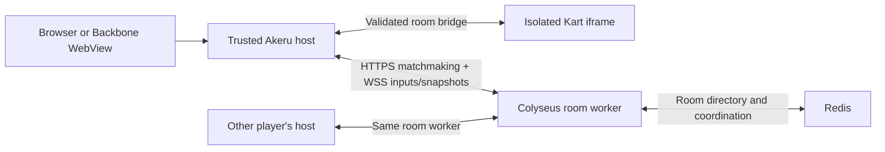

# Old San Juan Kart private multiplayer

Local evaluation, not publication approval. Existing source and asset rights remain pending. No production services or Backbone native code are changed.

## Try it

Use the repository's pinned Node/npm versions, then:

```sh
npm ci
npm run preview:kart-multiplayer
```

Open the printed `/play/old-san-juan-kart` URL in two separate browser profiles. Choose **Create private race**, copy the invite, and open it in the second profile. Both players ready up; the owner starts. Supports 2–4 guests, a four-second countdown, three laps, results, rematch, owner transfer, and leaving.

For two devices on the same trusted Wi-Fi, set `AKERU_LAN_HOST` to the computer's private IPv4 address before running the preview. The preview binds its shell, isolated title and room server on separate ports. Allow those ports through your local firewall. HTTP LAN mode is for keyboard/touch evaluation; secure audio-save revisions may be unavailable there; use HTTPS/WSS and a distinct title origin for mobile WebView/controller qualification. The default preview remains loopback-only.

Controller: stick/D-pad navigates the lobby, A selects. In a race, stick steers, A accelerates, B brakes, D-pad down drifts, D-pad up opens the race menu. Touch and keyboard also work. Invite links avoid typing a code on a controller. Online menus pause your input, not other players or the race clock.

## Architecture



- `multiplayer.rooms.v1` is an explicit capability request. Only a trusted shell factory configured for this title supplies it. The default catalog has no multiplayer grant. A manifest cannot supply a server URL, credentials or publication approval.
- The host owns the socket, endpoint, build ID and reconnection token. The title sends bounded input and lobby commands over its existing authenticated channel. Its network CSP is unchanged. Session tickets stay in host session storage, scoped to title, endpoint and build.
- Each room has one authoritative 60 Hz simulation and sends 20 Hz snapshots. Clients send up to 30 input messages per second. The server reuses verified upstream kart/track math; it accepts no client positions, laps, finish times or player IDs. Ordered checkpoints determine laps. Rendering interpolates snapshots; no client prediction in this version.
- Private room IDs carry 80 bits of randomness. Rooms are not listed or automatically matched. A link/code permits joining an available seat; it is not an account identity. At race start the roster locks. All clients must match the physics/protocol build ID.
- Inputs expire after 250 ms. A lost connection reserves the same seat for 30 seconds; reconnection resumes the live race. A reload offers **Reconnect to race** while the host ticket is valid. Permanent departure retires the kart. The first finisher starts a 30-second grace period; a race also has a ten-minute limit. Results distinguish unfinished racers. Rooms expire after 30 minutes; untouched initial lobbies after five.
- Requests have size/rate limits, explicit allowed shell origins, four seats and a ceiling of 100 rooms per process. These are safety limits, not measured production capacity. There is no cross-room state or directory endpoint. Only audio preferences use saves; live races are never restored from a save state.

## Running workers and scaling

Build with `npm run build:kart-multiplayer`, then run:

```sh
SHELL_ORIGINS=https://your-shell.example \
PORT=2567 HOST=0.0.0.0 \
node packages/old-san-juan-kart/multiplayer/server.mjs
```

The shell must serve the generated `dist/multiplayer/browser.js` module and pass `createKartMultiplayerFactory({endpoint: 'https://your-game-service.example'})` to `mountCatalog`. Use `options({multiplayer:true})` only in an explicitly approved registry/build path. This PR enables it in the dedicated local preview only.

For multiple workers, configure the same `REDIS_URL` and a **different, browser-routable `PUBLIC_ADDRESS` for each worker** (host:port or proxy host/path, without a scheme). Colyseus's shared driver/presence locates the owner of a room; the reservation directs the client's WebSocket to that worker. Do not randomly load-balance an established room socket. Redis coordinates workers; it does not run or persist the simulation. A worker crash ends its races. Rollouts need draining: stop allocating rooms to a worker, allow its races to finish, then terminate it.

Terminate TLS at the edge and enforce matchmaking/connection quotas there as well. The built-in limiter uses the direct peer IP, deliberately ignoring forwarded headers; behind a proxy it is only a backstop. Keep Redis private. `/health` reports process liveness. Before public launch, add queue/admission policy, capacity and regional latency measurements, operational metrics/alerts and worker draining. Do not equate the included scaling configuration with production load qualification.

## Scope and validation

This is a collision-free private race: no items, kart collisions, public matchmaking, chat, accounts, party API, or host migration. Road bounds use the pinned track-width fallback; server-side scenery collision baking is not included. All clients follow the same server road rules. Bluetooth hardware and iOS/Android lifecycle tests remain physical-device checks.

```sh
npm run check
npm run test:kart-multiplayer
```

Tests cover invalid input/state injection, missing grants, forged frames, private-room isolation/capacity, incompatible builds, authoritative driving, full-lap simulation, reconnects and the two-browser invite/ready/race flow. Backbone party support can later exchange the same scoped invite through a host-owned API without changing the game physics or exposing account credentials to the iframe.

Redis routing smoke test (use a dedicated test Redis instance):

```sh
KART_TEST_REDIS_URL=redis://127.0.0.1:6379 node --test tests/multiplayer-cluster.test.mjs
```

Container build: `docker build -f packages/old-san-juan-kart/multiplayer/Dockerfile -t akeru-kart .`. Run it with the explicit shell-origin and worker settings above; no deployment is performed by these commands.
